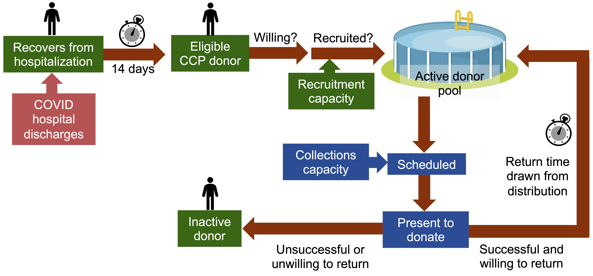

# COVID-19 Convalescent Plasma Model

This tool was developed by researchers at Vitalant Research Institute to model COVID-19 Convalescent Plasama collection and distribution to inform policy and operations.

The model has two main components, an agent-based microsimulation used to simulate the donor recruitment and collection process, and a linked production and demand model to project CCP release, distribution and inventory. The model utilizes estimates and projections of COVID-19 patients discharged from hospital supplied by an external epidemic model to create agents that can be recruited as CCP donors. New hospital admissions from the same epidemic model are used to inform the CCP demand model.

## Model structure

The structure of the microsimulation model is shown in the figure below.

The production and demand model applies multipliers to the output of the microsimulation model to project the number of CCP units utilized and stockpiled over time.

## Authors

* [Eduard Grebe](https://github.com/eduardgrebe) (Vitalant Research Institute, University of California San Francisco)
* W. Alton Russell (Stanford University, Vitalant Research Institute)
* Brian Custer (Vitalant Research Institute, University of California San Francisco)

## Acknowledgements

The authors thank the following individuals for information on CCP operations and advice on model development:

* Larry J. Dumont (Vitalant Research Institute, Geisel School of Medicine at Dartmouth, University of Colorado School of Medicine)
* Ralph R. Vassallo (Vitalant, University of New Mexico School of Medicine)
* Cliff Numark (Vitalant)
* Travis Glanzer (Vitalant)
* Paula Villalobos-Jimenez (Vitalant)
* Janice Douke (Vitalant)
* Roxanne Tata (Vitalant)
* Jackie Vannoy (Vitalant)
* Sarina Swan (Vitalant)
* Candelaria Acosta (Vitalant)

The authors further thank

* [Nathan Geffen](https://www.simhub.online/nathan/) for technical advice and acknowledge taking direct inspiration from his Python microsimulation code
* Andrea Stone for legal advice

This software is made possible by numerous open source projects, including the [R](https://www.r-project.org) and [Python](https://www.python.org) programming languages, the [Shiny](https://shiny.rstudio.com) framework, the [tidyverse](https://www.tidyverse.org) suite of R packages and the [Numpy](https://numpy.org) and [Scipy](https://www.scipy.org) Python packages.

## Epidemic estimates

Epidemic estimates are sourced from the [Institute for Health Metrics and 
Evaluation](http://www.healthdata.org) at the University of Washington and are 
reproduced under the terms of the [Creative Commons Attribution-NonCommercial 
4.0 International License](https://creativecommons.org/licenses/by-nc/4.0/).

## Usage terms

Copyright © 2020 Vitalant and W. Alton Russell. All rights reserved.

This program is free software: you can redistribute it and/or modify
it under the terms of the GNU Affero General Public License as published by
the Free Software Foundation, either version 3 of the License, or
(at your option) any later version.

The software is distributed in the hope that it will be useful,
but WITHOUT ANY WARRANTY; without even the implied warranty of
MERCHANTABILITY or FITNESS FOR A PARTICULAR PURPOSE. See the
GNU Affero General Public License for more details.

You should have received a copy of the GNU Affero General Public License
along with this software. If not, see <http://www.gnu.org/licenses/>.
